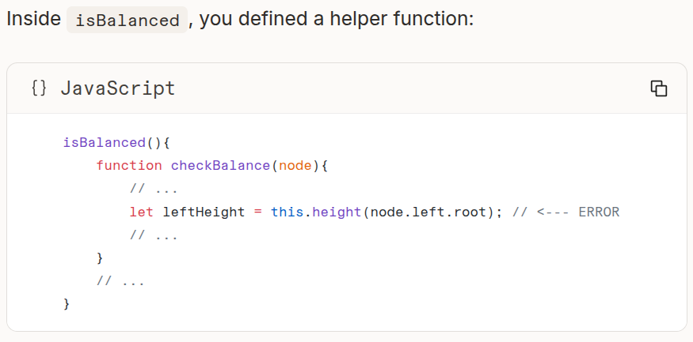
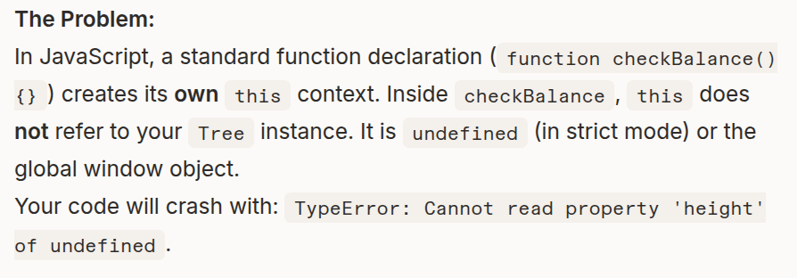

# 1.In JS classes, the method that handles arguments when you first create the class is called the constructor

# 2.Sorting numbers of an array:
const numbers = [100, 20, 5, 42];
numbers.sort((a,b)=>a-b);
console.log(numbers);
// Result: [5, 20, 42, 100]

# 3.remove the first item in an array: shift()
const fruits = ['apple', 'banana', 'cherry'];
const firstFruit = fruits.shift();

console.log(fruits);      // Output: ['banana', 'cherry']
console.log(firstFruit);  // Output: 'apple'

# 4.remove the last item in an array: pop()

# 5.To traverse a binary tree in breadth-fisrt level-order in js, you use a queue
In JS, there is no native Queue class in the standard library. You typically simulate one using an array and its built-in methods like .push() and .shift()

The situation is quite different in C and C++
C++:built-in and powerful (std::queue from the <queue> header)

C:typically implement queues using either a linked list (for dynamic sizing) or a fixed-size array with "front" and "rear" pointers to track the current position (manually via 'struct' and pointers (linked list or array))

# 6.recursion is good for DFS, iteration (queue) is good for BFS

# 7.Perform a type check to check if the callback is provided and valid in JS
eg.
levelOrderForEach(callback){
    if(typeof callback!=='function'){
        throw new Error('A callback is required');
    }
    ..........
}

# 8.Don't assign this.root in functions like buildTree method because the method is recursive so this.root changes every time the function executes and finally this.root will become the last leaf of the tree instead of the root of the tree
Only assign this.root once in the constructor. 

# 9.Be careful not to dropping children when deleting a node
node deletion in BST:(3 different cases)
1) node with 0 child   
2) node with 1 child
3) node with 2 children (Be careful with 'grandchildren case')
Don't set 'null' to a node without thinking! will it leads to node's losing grandchildren?

# 10.'return inner()'!
If you define an inner function inside an outer function and want the outer one return what the inner one returns, don't forget 'return inner()'!

# 11.The 'this' scope bug 

# 12.when a recursion is a property of a class, you need to add 'this' when calling itself